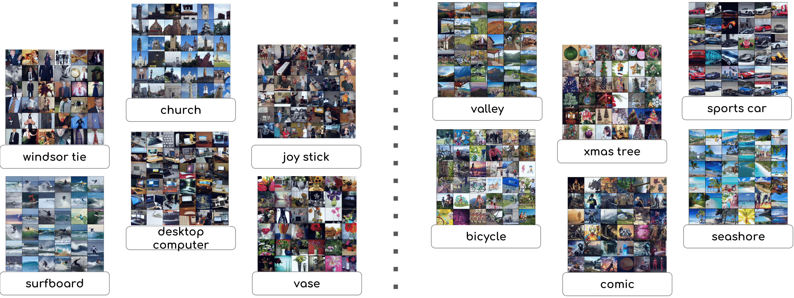

# CPP(Clustering via Principle of rate reduction and Pretrained model)

by [Tianzhe Chu*](https://tianzhechu.com), [Shengbang Tong*](https://tsb0601.github.io/petertongsb/), [Tianjiao Ding*](https://tianjiaoding.com), [Xili Dai](https://delay-xili.github.io/), [Benjamin David Haeffele](https://www.cis.jhu.edu/~haeffele/), [Rene Vidal](http://vision.jhu.edu/rvidal.html), [Yi Ma](http://people.eecs.berkeley.edu/~yima/) (* means equal contribution)



## Introduction
This repo is the official implementation for the paper "[Image Clustering via the Principle of Rate Reduction in the Age of Pretrained Models](https://arxiv.org/abs/2306.05272)".
This paper proposes a novel image clustering pipeline that integrates pre-trained models and rate reduction, enhancing clustering accuracy and introducing an effective self-labeling algorithm for unlabeled datasets at scale.

## Version

(2023.6 Version 0) Version 0 finished, currently support training for CIFAR and ImageNet; Optimal Number of Clusters Measurement; Self-labeling. 
What to Expect in Next Steps: Pretrained checkpoints

## Install Dependencies

We adopt the pretrained CLIP model from OpenAI's official repository https://github.com/openai/CLIP. To install all the dependencies, run the following command:
```python
git clone https://github.com/LeslieTrue/CPP.git
conda create -n CPP python==3.9
cd CPP
conda activate CPP
pip install git+https://github.com/openai/CLIP.git
pip install -r requirements.txt
```
## Preparing Data
Since we use CLIP's image encoder as a frozen backbone, there are two ways to define the networks: i. with backbone inside; ii. without the backbone; which correspond to the following ways of dataset initialization respectively.
### i. As RGB Images
It's a regular procedure to train a CPP model using datasets with RGB images when defining the network with backbone inside.
### ii. As CLIP Features
To reduce the inference time of frozen pretrained networks, we suggest to preprocess the dataset using CLIP's image encoder and train a CPPNet using a network without the backbone.

## Training

#### Example training command for CIFAR-10, directly using raw datasets.

```python
python main.py --data_dir ./data --bs 1024 --desc train_CPP_CIFAR10\
 --lr 1e-4 --lr_c 1e-4 --pieta 0.175 --epo 15 --hidden_dim 4096 --z_dim 128 --warmup 50
```

#### Example training command for ImageNet, using preprocessed data.

Step1: Preprocess the data

```python
python ./data/preprocess.py --data imagenet --path ./data --feature_dir ./imagenet-feature.pt
```

Step2: Training

```python
python main_efficient.py --data_dir imagenet-feature.pt --bs 1024 --desc train_CPP_imagenet\
 --lr 1e-4 --lr_c 1e-4 --pieta 0.12 --epo 20 --hidden_dim 2048 --z_dim 1024 --warmup 2000 --n_clusters 1000
```

## More Results


```python
python optimalcluster.py
python labeling.py
```

## Cite

If you find the repo useful or interesting, plz give a star~~ :D

```
@article{chu2023image,
  title={Image Clustering via the Principle of Rate Reduction in the Age of Pretrained Models},
  author={Chu, Tianzhe and Tong, Shengbang and Ding, Tianjiao and Dai, Xili and Haeffele, Benjamin David and Vidal, Rene and Ma, Yi},
  journal={arXiv preprint arXiv:2306.05272},
  year={2023}
}
```

